# Architectural Audit Report — Sistem Informasi Peminjaman Buku Perpustakaan

**Date:** 2026-07-02  
**Project:** nextjs_tailwind_shadcn_ts (v0.2.0)  
**Audit Type:** Full Architectural Review + Supabase Migration Readiness  
**Author:** Principal Software Architect / Tech Lead / Security Reviewer  

---

## Table of Contents

1. [Project Overview](#1-project-overview)
2. [Folder Structure Review](#2-folder-structure-review)
3. [Dependency Analysis](#3-dependency-analysis)
4. [Next.js Best Practices](#4-nextjs-best-practices)
5. [Component Architecture](#5-component-architecture)
6. [Hooks Review](#6-hooks-review)
7. [State Management](#7-state-management)
8. [API Layer Review](#8-api-layer-review)
9. [Database Layer](#9-database-layer)
10. [Business Logic](#10-business-logic)
11. [Authentication](#11-authentication)
12. [Security Review](#12-security-review)
13. [Environment Variables](#13-environment-variables)
14. [Error Handling](#14-error-handling)
15. [Logging](#15-logging)
16. [Performance](#16-performance)
17. [Code Quality](#17-code-quality)
18. [TypeScript Quality](#18-typescript-quality)
19. [API Best Practices](#19-api-best-practices)
20. [Scalability](#20-scalability)
21. [Maintainability](#21-maintainability)
22. [Technical Debt](#22-technical-debt)
23. [Code Smells](#23-code-smells)
24. [Plus and Minus](#24-plus-and-minus)
25. [Architecture Diagram](#25-architecture-diagram)
26. [Migration Readiness](#26-migration-readiness)
27. [Supabase Migration Strategy](#27-supabase-migration-strategy)
28. [Refactoring Strategy](#28-refactoring-strategy)
29. [Priority Matrix](#29-priority-matrix)
30. [Final Score](#30-final-score)

---

## 1. Project Overview

### What This Application Does

A web-based library management system ("Sistem Informasi Peminjaman Buku Perpustakaan") built for Universitas Airlangga (UNAIR), Kelompok 9. The system allows:

- **Admins** to manage books, categories, members, loans, returns, fines, and generate reports.
- **Members (Anggota)** to browse the catalog, borrow books, view their active loans/history/fines, and receive notifications about due dates.

### Overall Architecture

```
┌─────────────────────────────────────────────────┐
│                 Browser (Client)                  │
│  ┌───────────────────────────────────────────┐   │
│  │         Next.js App (React SPA)            │   │
│  │  ┌──────────┐  ┌──────────┐  ┌────────┐  │   │
│  │  │  Auth     │  │  Views   │  │ Store  │  │   │
│  │  │  (Login/  │  │ (Admin/  │  │(Zustand│  │   │
│  │  │  Register)│  │  Anggota)│  │  + API)│  │   │
│  │  └──────────┘  └──────────┘  └────────┘  │   │
│  └───────────────────────────────────────────┘   │
└──────────────────────┬──────────────────────────┘
                       │ HTTP (fetch)
                       ▼
┌─────────────────────────────────────────────────┐
│             Next.js API Routes (Server)           │
│  ┌──────────┐ ┌──────────┐ ┌──────────┐          │
│  │  Auth    │ │  CRUD    │ │  Laporan │          │
│  │  (Sesi   │ │ (Buku,   │ │  (Stats, │          │
│  │  Cookie) │ │ Anggota, │ │  Filter) │          │
│  │          │ │ Pinjam)  │ │          │          │
│  └──────────┘ └──────────┘ └──────────┘          │
└──────────────────────┬──────────────────────────┘
                       ▼
┌─────────────────────────────────────────────────┐
│          Prisma ORM → SQLite (Local)             │
│  ┌───────────────────────────────────────────┐   │
│  │  admin, kategori, anggota, buku,          │   │
│  │  peminjaman, detail_peminjaman, denda     │   │
│  └───────────────────────────────────────────┘   │
└─────────────────────────────────────────────────┘
```

### Application Flow

1. User visits `/` → client-side check for session cookie via `GET /api/auth/me`
2. If no session → `<AuthPage />` (login/register)
3. If `role === "admin"` → `<AdminShell />` with 8 views (dashboard, buku, kategori, anggota, peminjaman, pengembalian, denda, laporan)
4. If `role === "anggota"` → `<AnggotaShell />` with 6 views (katalog, status, riwayat, denda, notifikasi, profil)
5. All navigation is client-side via Zustand store — **no route changes** after the initial `/`

### Rendering Strategy

- **Single root page** (`page.tsx`) with `"use client"` — the entire app is a **Client-Side Rendered (CSR) SPA** inside a single route.
- No Server Components, no Streaming, no Suspense boundaries.
- All data fetching uses `useEffect` + `fetch` inside client components.

### Routing Strategy

- App Router (`/src/app`) with only one user-facing route (`/`).
- All API routes follow REST-like conventions under `/api/*`.
- No route groups, no parallel routes, no intercepting routes.

### Folder Organization

```
src/
├── app/            # App Router (layout, page, api routes)
├── components/     # UI components
│   ├── admin/      # Admin-specific views
│   ├── anggota/    # Member-specific views
│   ├── auth/       # Auth page
│   ├── shared/     # Shared shell & helpers
│   └── ui/         # shadcn/ui primitives (48 files)
├── hooks/          # Custom hooks (use-mobile, use-toast)
├── lib/            # Utilities, API client, types, store, auth, db
```

### Major Modules

| Module | Lines | Responsibility |
|--------|-------|----------------|
| `lib/api.ts` | ~80 | Server-side response helpers (`ok`, `fail`, `apiHandler`, `nextId`) |
| `lib/auth.ts` | ~100 | Session management (signed cookies), bcrypt, role guards |
| `lib/api-client.ts` | ~90 | Client-side fetch wrapper + formatters |
| `lib/db.ts` | ~15 | Prisma client singleton |
| `lib/store.ts` | ~70 | Zustand global state (user, view, logout) |
| `lib/types.ts` | ~200 | All TypeScript type definitions |
| `components/shared/shell-layout.tsx` | ~200 | Responsive sidebar layout |
| `components/admin/views/` | ~8 files, ~3000 total | Admin CRUD views |
| `components/anggota/views/` | ~6 files, ~1700 total | Member views |
| `app/api/` | ~24 files, ~2000 total | REST API route handlers |
| `prisma/schema.prisma` | ~140 | Database schema (SQLite) |
| `prisma/seed.ts` | ~170 | Seed data |

### Feature Boundaries

- **Authentication**: Custom session-based auth using signed cookies (HMAC-SHA256) + bcrypt. Two roles: `admin` and `anggota`.
- **Admin Capabilities**: Full CRUD on books, categories, members; process returns with fine calculation; view/print reports with filtering.
- **Member Capabilities**: Browse/search/sort book catalog, borrow up to 3 books, view active loan status, history, fines, notifications about due dates, edit own profile.
- **Business Rules**: Max 3 books per loan, 7-day loan period, Rp 2000/day late fee, one active loan at a time, members must be verified ("Aktif") to borrow.

---

## 2. Folder Structure Review

### `src/app/`

**Responsibility:** Next.js App Router entry point + all API routes.

**Strengths:**
- Clean separation of user and API routes.
- API routes follow a consistent naming convention (`/api/{resource}/[id]`).
- Auth-related routes are grouped under `/api/auth/`.

**Weaknesses:**
- Only one user-facing page (`/`). Everything else is client-side view switching. This defeats the purpose of the App Router.
- `layout.tsx` uses Geist font from Google Fonts (external dependency).
- No metadata for individual views (single global metadata).

**Recommendations:**
- Convert admin and member views into actual routes (e.g., `/admin/buku`, `/anggota/katalog`).
- Leverage Server Components for initial data fetching on each route.
- Remove `favicon` URL dependency (hardcoded to external CDN).

### `src/components/`

**Responsibility:** All UI components.

**Strengths:**
- Clean separation: `admin/`, `anggota/`, `auth/`, `shared/`, `ui/`.
- `ui/` directory properly uses shadcn/ui conventions.
- `shared/` contains reusable layout and helper components.

**Weaknesses:**
- Components are **monolithic** — some views exceed 700 lines (katalog-view.tsx: 712, laporan-view.tsx: 779).
- Tight coupling between view components and the API client (direct `api.get()` calls).
- No loading skeletons defined at the component level — each view duplicates skeleton logic.
- The `ui/` folder has 48 shadcn component files — many unused (e.g., `context-menu.tsx`, `menubar.tsx`, `resizable.tsx`).

**Recommendations:**
- Extract reusable data-fetching hooks per resource.
- Split large components (laporan-view.tsx has 3 sub-components that should be separate files).
- Prune unused shadcn components.
- Create a shared `LoadingSkeleton` component pattern.

### `src/hooks/`

**Responsibility:** Custom React hooks.

**Strengths:**
- `use-toast.ts` is a well-implemented toast notification system.
- `use-mobile.ts` correctly uses `matchMedia` with cleanup.

**Weaknesses:**
- Only 2 hooks — inadequate for the application size.
- No data-fetching hooks, no debounce hooks, no auth hooks.

**Recommendations:**
- Extract `useBuku()`, `useAnggota()`, `usePeminjaman()`, etc. as reusable hooks.
- Create `useDebounce()` to eliminate the duplicated debounce logic across 4 components.

### `src/lib/`

**Responsibility:** Shared utilities, API client, types, store, auth, database.

**Strengths:**
- `db.ts` correctly implements Prisma singleton pattern.
- `types.ts` is comprehensive with detailed documentation references.
- `api-client.ts` provides a clean fetch wrapper with `ApiError` class.
- `api.ts` provides consistent server-side response helpers.
- `auth.ts` implements a reasonable custom session system.
- `utils.ts` properly uses `clsx` + `tailwind-merge` (shadcn convention).
- `store.ts` correctly uses Zustand with proper TypeScript typing.

**Weaknesses:**
- `api-client.ts` includes `"use client"` directive but exports pure utility functions (`formatRupiah`, `formatDate`, `formatDateTime`, `hariTerlambat`) that are imported by server-side API routes (e.g., `notifikasi/route.ts`). Though functionally safe, this is semantically incorrect and may confuse tools/bundlers.
- No separate `services/` layer — API calls are made directly from components.
- No repository pattern — database access is done directly in API route handlers.

**Recommendations:**
- Remove `"use client"` from `api-client.ts` or split into `client.ts` and `shared.ts`.
- Introduce a service layer for business logic.
- Introduce repository abstraction for Prisma queries.

### `prisma/`

**Responsibility:** Database schema and seed data.

**Strengths:**
- Schema is well-documented with references to the academic paper (DFD, CDM/PDM).
- Seed data is comprehensive with realistic sample data.
- Properly handles the circular reference resolution between denda and detail_peminjaman.

**Weaknesses:**
- Uses SQLite (file-based) — not suitable for production at scale.
- `tanggalDaftar` on `Anggota` has no `@default(now())` — must be set in application code.
- Password fields are stored directly (even if hashed) — would need migration for Supabase Auth.
- Custom ID format (`ADM001`, `BK0001`, etc.) is string-based with manual generation — fragile under concurrency.

**Recommendations:**
- Plan migration from SQLite to PostgreSQL (Supabase).
- Use `@default(now())` for date fields where possible.
- Replace custom ID generation with auto-increment + display formatting.
- Add proper indexes beyond what exists.

---

## 3. Dependency Analysis

### Package: `package.json`

| Dependency | Version | Assessment |
|-----------|---------|------------|
| `next` | ^16.1.1 | ✅ Latest stable |
| `react` / `react-dom` | ^19.0.0 | ✅ Latest |
| `@prisma/client` / `prisma` | ^6.11.1 | ✅ Latest |
| `next-auth` | ^4.24.11 | ⚠️ BOTH custom auth AND next-auth installed — next-auth is UNUSED |
| `zustand` | ^5.0.6 | ✅ Latest |
| `@tanstack/react-query` | ^5.82.0 | ⚠️ Installed but UNUSED — all data fetching uses raw `useEffect` + `fetch` |
| `@tanstack/react-table` | ^8.21.3 | ⚠️ Installed but UNUSED — all tables are hand-built |
| `bcryptjs` | ^3.0.3 | ✅ Used for password hashing |
| `@hookform/resolvers` | ^5.1.1 | ⚠️ Installed but `react-hook-form` is used without resolvers |
| `@reactuses/core` | ^6.0.5 | ⚠️ Utility library — check actual usage |
| `framer-motion` | ^12.23.2 | ⚠️ Installed but UNUSED — no animations found |
| `embla-carousel-react` | ^8.6.0 | ⚠️ Installed but UNUSED |
| `input-otp` | ^1.4.2 | ⚠️ Installed but UNUSED |
| `cmdk` | ^1.1.1 | ⚠️ Installed but UNUSED |
| `vaul` | ^1.1.2 | ⚠️ Installed but UNUSED (drawer component) |
| `react-resizable-panels` | ^3.0.3 | ⚠️ Installed but UNUSED |
| `react-syntax-highlighter` | ^15.6.1 | ⚠️ Installed but UNUSED |
| `z-ai-web-dev-sdk` | ^0.0.18 | ⚠️ AI SDK — potentially unused in production |
| `recharts` | ^2.15.4 | ✅ Used in dashboard and laporan views |
| `sonner` | ^2.0.6 | ✅ Used for toast notifications |
| `date-fns` | ^4.1.0 | ⚠️ Installed but UNUSED — all date formatting uses manual `Intl` / `toLocaleDateString` |
| `@types/bcryptjs` | ^3.0.0 | ⚠️ Deprecated — `bcryptjs` now includes its own types |
| `uuid` | ^11.1.0 | ⚠️ Installed but UNUSED — ID generation is custom |
| `sharp` | ^0.34.3 | ✅ Needed for Next.js image optimization |
| `tailwindcss-animate` | ^1.0.7 | ✅ Used in tailwind.config.ts |

### Unnecessary Dependencies (can be removed)

- `next-auth` — custom auth is used instead
- `@tanstack/react-query` — all fetching uses raw `fetch`
- `@tanstack/react-table` — tables are hand-built
- `framer-motion` — no animations
- `embla-carousel-react` — no carousels
- `input-otp` — no OTP input
- `cmdk` — no command menu
- `vaul` — no drawer usage
- `react-resizable-panels` — no resizable panels
- `react-syntax-highlighter` — no code syntax display
- `date-fns` — not used anywhere
- `uuid` — not used anywhere
- `@reactuses/core` — verify usage; likely unused
- `z-ai-web-dev-sdk` — verify production necessity

### Missing Dependencies

- `zod` — for API request validation (currently all validation is manual)
- `@supabase/supabase-js` — for future Supabase integration
- `@supabase/ssr` — for Supabase SSR auth
- `cross-env` — for cross-platform environment variables

### Recommendations

- Run `npm uninstall` on all unused packages to reduce bundle size.
- Either remove `next-auth` entirely or migrate to it (but since Supabase Auth is the target, remove it).
- Consider using `@tanstack/react-query` for data fetching instead of `useEffect` (it's already installed).

---

## 4. Next.js Best Practices

### App Router Usage

| Practice | Status | Evidence |
|----------|--------|----------|
| Server Components | ❌ Not used | All components have `"use client"` |
| Client Components | ✅ Used everywhere | Correctly marked |
| Suspense Boundaries | ❌ Not used | No `Suspense`, no `fallback` |
| Streaming | ❌ Not used | No `loading.tsx`, no `streaming` |
| Layouts | ✅ Partial | One root `layout.tsx` |
| Route Groups | ❌ Not used | No `(group)` folders |
| Metadata (per-route) | ❌ Not used | Global only |
| Server Actions | ❌ Not used | All mutations via API routes |
| Dynamic Rendering | ✅ Used | API routes are dynamic |
| Static Rendering | ✅ Used | Root page is statically rendered at build |
| ISR | ❌ Not used | N/A (only one static page) |
| Middleware | ❌ Not used | No `middleware.ts` |

### Issues Found

**1. Entire App is a Single Client Component**

`src/app/page.tsx` uses `"use client"` and the entire application (auth, admin, member) is rendered within this single component by switching Zustand view states. This means:
- No route-based code splitting.
- All JavaScript for ALL views is downloaded on initial load.
- No per-view metadata, SEO, or social preview.
- Browser's back/forward buttons don't navigate between views.

**2. No Server Components for Data Fetching**

All data fetching happens in `useEffect` on the client. There are no Server Components that could:
- Fetch initial data during SSR/SSG.
- Reduce client-side waterfall requests.
- Improve perceived performance.

**3. No Middleware for Auth**

Authentication checks happen inside each API route via `requireAdmin()` / `requireAnggota()`. There is no `middleware.ts` that could:
- Redirect unauthenticated users at the edge.
- Protect routes declaratively.
- Reduce boilerplate in each route handler.

**4. `reactStrictMode: false` in `next.config.ts`**

This disables React Strict Mode, which means:
- Potential side effects in development go undetected.
- Double-rendering (for detecting impure effects) is disabled.

**5. TypeScript Errors Ignored in Build**

```typescript
// next.config.ts
typescript: {
  ignoreBuildErrors: true,
}
```

This is dangerous — TypeScript errors (including the 4 found by `tsc --noEmit`) are suppressed during production builds, allowing type-unsafe code to be deployed.

### Recommendations

- Split the app into actual routes: `/login`, `/admin/*`, `/anggota/*`.
- Use Server Components for initial data fetching on each route.
- Add `middleware.ts` for authentication checks.
- Enable `reactStrictMode: true`.
- Remove `ignoreBuildErrors` and fix the TypeScript errors.

---

## 5. Component Architecture

### Component Composition

```
RootLayout
└── Page (Home)
    ├── LoadingState (spinner)
    ├── AuthPage
    │   └── LoginForm / RegisterForm (inside auth-page.tsx)
    ├── AdminShell
    │   ├── ShellLayout (sidebar + header + content)
    │   └── Views: Dashboard | Buku | Kategori | Anggota | Peminjaman | Pengembalian | Denda | Laporan
    └── AnggotaShell
        ├── ShellLayout (sidebar + header + content)
        └── Views: Katalog | Status | Riwayat | Denda | Notifikasi | Profil
```

### Prop Drilling

Minimal prop drilling — most state is managed through Zustand (`useApp`). Components pass data via props only for local state (e.g., `PeminjamanCard`, `PengembalianCard`).

### Reusable Components

- `ShellLayout` — shared responsive layout with sidebar
- `PageHeader` — title + description + action pattern
- `StatCard` — metric display card with icon
- `EmptyState` — empty state placeholder
- `StatusBadge` — status indicator with color coding
- `ui/*` — 48 shadcn primitives

### Issues Found

**1. Large Components**

| Component | Lines | Issues |
|-----------|-------|--------|
| `laporan-view.tsx` | 779 | Contains 3 sub-components that should be separate files |
| `katalog-view.tsx` | 712 | Contains `InfoRow` sub-component, detail dialog, confirmation dialog |
| `buku-view.tsx` | 400+ | Dialog, alert-dialog, filter bar, table all in one file |
| `anggota-view.tsx` | 400+ | Same pattern |
| `peminjaman-view.tsx` | 278 | Contains `PeminjamanCard` inline |
| `pengembalian-view.tsx` | 295 | Contains `PengembalianCard` inline |

**2. Duplicated Patterns**

Every data-fetching view follows the same pattern:
```typescript
const [data, setData] = useState<Type[]>([])
const [loading, setLoading] = useState(true)
const [error, setError] = useState<string | null>(null)

useEffect(() => {
  let active = true
  setLoading(true)
  api.get<Type[]>("/api/...").then(...).catch(...).finally(...)
  return () => { active = false }
}, [])
```

This pattern is repeated in **at least 12 components**. It should be extracted into a reusable hook.

**3. Tight Coupling**

- Components are tightly coupled to the API layer — they call `api.get()` directly.
- Components know about URL paths (`/api/buku`, `/api/peminjaman/anggota/${id}`, etc.).
- Business logic (e.g., the `StatusBadge` color mapping) is embedded in UI components.

**4. Duplicated Sub-Components**

- `PeminjamanCard` in `peminjaman-view.tsx` and `PengembalianCard` in `pengembalian-view.tsx` share ~80% of their code.
- The `StokBadge` in `buku-view.tsx` duplicates logic from `StatusBadge`.
- `KelaminBadge` in `anggota-view.tsx` is another duplicate of `StatusBadge`.

### Recommendations

- Split `laporan-view.tsx`, `katalog-view.tsx` into separate files per sub-component.
- Create a generic `useFetch<T>` hook.
- Extract common card components (e.g., `LoanCard` shared between peminjaman and pengembalian views).
- Move business logic (e.g., `StatusBadge` color mapping) to a utility file.

---

## 6. Hooks Review

### `use-mobile.ts` (24 lines)

**Responsibility:** Detect mobile viewport (< 768px).

**Quality:** ✅ Good. Properly uses `matchMedia`, handles cleanup, initializes correctly.

### `use-toast.ts` (120 lines)

**Responsibility:** Toast notification system (inspired by react-hot-toast).

**Quality:** ✅ Good. Implements a reducer pattern, handles add/update/dismiss/remove, limits toasts. Used throughout the app via `sonner` (re-exported as `toast`).

### Missing Hooks

The following should be extracted as custom hooks:

- `useDebounce(value, delay)` — currently duplicated in `buku-view.tsx`, `anggota-view.tsx`, `peminjaman-view.tsx`, `katalog-view.tsx`.
- `useFetch<T>(url, deps)` — generic data fetching with loading/error states.
- `useBuku()`, `useAnggota()`, `usePeminjaman()` — resource-specific hooks.
- `useAuth()` — wraps `useApp` for auth-specific selectors.
- `useNotifications()` — poll for notifications with interval.

---

## 7. State Management

### Technologies Used

| Tool | Scope | Usage |
|------|-------|-------|
| Zustand (`useApp`) | Global | User session, current view (admin/anggota), logout function |
| React `useState` | Local | Component-level state (form inputs, dialog open, data, loading, error) |
| React `useEffect` | Side effects | Data fetching, debounce, polling |
| React `useMemo` | Memoization | Computed values from fetched data |

### Zustand Store (`store.ts`)

```typescript
type AppState = {
  user: SessionUser | null      // Current session
  loading: boolean               // Auth check loading
  setUser: (u) => void          // Set user
  setLoading: (b) => void       // Set loading
  logout: () => Promise<void>   // Logout + reset state
  adminView: AdminView          // Current admin view
  setAdminView: (v) => void     // Change admin view
  anggotaView: AnggotaView      // Current member view
  setAnggotaView: (v) => void   // Change member view
}
```

### Issues Found

**1. Global View State**

The `adminView` and `anggotaView` are global Zustand state but they control UI navigation within a single page. This is an anti-pattern:
- View state should be derived from the URL (route).
- The browser back/forward buttons don't work.
- Deep linking into specific views is impossible.

**2. No React Query / SWR for Server State**

Despite `@tanstack/react-query` being installed, all server state is managed via `useState` + `useEffect`. This means:
- No automatic caching.
- No background refetching.
- No stale-while-revalidate.
- Manual loading/error state management in every component.
- No request deduplication.
- No optimistic updates.

**3. Redundant Local State**

Several components manage state that could be derived:
- `filtered` lists computed with `useMemo` instead of being a server-side filter.
- `summary` objects recomputed in multiple components.

**4. Logout Implementation**

```typescript
logout: async () => {
  await fetch("/api/auth/logout", { method: "POST" })
  set({ user: null, adminView: "dashboard", anggotaView: "katalog" })
}
```

The logout is an event that fires-and-forgets. If the fetch fails, the user is still logged out on the client but the server session persists. There is no error handling.

### Recommendations

- Remove `adminView` and `anggotaView` from global store; use URL-based routing instead.
- Integrate `@tanstack/react-query` for all server state (it's already installed).
- Add error handling to the logout function.
- Keep only truly global state in Zustand (user session, theme, etc.).

---

## 8. API Layer Review

### Current API Architecture

```
/api                          → GET    (health check)
/api/auth/login               → POST   (login admin/anggota)
/api/auth/logout              → POST   (logout)
/api/auth/me                  → GET    (get current session)
/api/auth/register            → POST   (register new member)
/api/anggota                  → GET    (list members, admin)
/api/anggota                  → POST   (create member, admin)
/api/anggota/me               → GET    (get own profile, member)
/api/anggota/me               → PUT    (update own profile, member)
/api/anggota/[id]             → GET    (get member detail, admin)
/api/anggota/[id]             → PUT    (update member, admin)
/api/anggota/[id]             → DELETE (delete member, admin)
/api/anggota/[id]/verify      → PATCH  (toggle member status, admin)
/api/buku                     → GET    (list books, public)
/api/buku                     → POST   (create book, admin)
/api/buku/[id]                → GET    (get book detail)
/api/buku/[id]                → PUT    (update book, admin)
/api/buku/[id]                → DELETE (delete book, admin)
/api/kategori                 → GET    (list categories)
/api/kategori                 → POST   (create category, admin)
/api/kategori/[id]            → PUT    (update category, admin)
/api/kategori/[id]            → DELETE (delete category, admin)
/api/peminjaman               → GET    (list loans, admin)
/api/peminjaman               → POST   (create loan, member)
/api/peminjaman/[id]          → GET    (get loan detail)
/api/peminjaman/anggota/[id]  → GET    (get member's loans)
/api/pengembalian             → POST   (return book, admin)
/api/denda                    → GET    (list fines, admin)
/api/denda/[id]/bayar         → PATCH  (mark fine paid, admin)
/api/laporan                  → GET    (dashboard summary, admin)
/api/laporan/peminjaman       → GET    (loan report, admin)
/api/laporan/denda            → GET    (fine report, admin)
/api/laporan/anggota          → GET    (member report, admin)
/api/notifikasi               → GET    (notifications, member/admin)
```

### REST Design Evaluation

| Criteria | Rating | Notes |
|----------|--------|-------|
| Resource naming | ✅ Good | Plural nouns, consistent |
| HTTP methods | ✅ Good | GET/POST/PUT/PATCH/DELETE used correctly |
| Status codes | ✅ Good | 200, 201, 401, 403, 404, 409, 422 |
| Response consistency | ⚠️ Mixed | `ok(data)` vs `ok({ error: "Forbidden" }, 403)` inconsistency |
| Error format | ✅ Good | `{ error: string, details?: unknown }` |
| Query params | ✅ Good | used for filtering, search, sort |

### Issues Found

**1. Response Inconsistency in `/api/peminjaman/anggota/[id]`**

```typescript
// src/app/api/peminjaman/anggota/[id]/route.ts
if (session.id !== id) {
  return ok({ error: "Forbidden" }, 403)  // Should use fail()
}
```

This returns `NextResponse.json({ error: "Forbidden" }, { status: 403 })` instead of using the `fail()` helper. The response format differs from all other error responses.

**2. No Request Body Validation**

All API routes manually check fields:
```typescript
if (!namaAnggota || !jenisKelamin || !email || !password) {
  return fail("Nama, jenis kelamin, email, password wajib diisi", 422)
}
```

There is no validation library (Zod, Yup) used. This means:
- Error messages are inconsistent.
- No type-safe request parsing.
- Input sanitization is manual and potentially incomplete.
- Validation logic is duplicated across routes.

**3. No Rate Limiting**

No rate limiting on any endpoint. Login endpoint is particularly vulnerable to brute-force attacks.

**4. Type `any` Usage in Where Clauses**

Many API routes use `where: any = {}` for Prisma queries with dynamic filters. This bypasses TypeScript safety:
```typescript
const where: any = {}
if (status) where.statusAnggota = status
if (q) { where.OR = [...] }
```

**5. `nextId()` — Custom ID Generation**

The `nextId()` function in `lib/api.ts` reads all existing records to find the maximum number and generates the next ID. This has several issues:
- **Race condition**: Two concurrent requests could get the same max value and generate duplicate IDs.
- **Performance**: Reads all records just to generate one ID. O(n) per insert.
- **Fragile**: The ID format (`ADM001`, `BK0001`, etc.) is hardcoded in multiple places.

**6. Redundant ID Generation in `peminjaman/route.ts`**

The POST handler for peminjaman has its own ID generation logic that duplicates `nextId()`:
```typescript
let detailCounter = await tx.detailPeminjaman.count()
// ...
const idDetail = `DTL${String(detailCounter).padStart(4, "0")}`
```

### Auth/Authorization Issues

- Some routes use `try/catch` for authorization checks instead of a clean guard pattern.
- The `/api/peminjaman/[id]` GET handler uses try/catch to check admin then falls through to member check — fragile and non-obvious.

### Supabase Integration Assessment

The current API routes would need significant changes for Supabase:
- Direct Prisma calls must be replaced with Supabase client calls.
- Custom auth cookies must be replaced with Supabase Auth sessions.
- The `ok`/`fail`/`apiHandler` wrapper pattern can remain (returns `NextResponse`).
- Route structure itself can remain the same.

---

## 9. Database Layer

### Current Stack

- **ORM:** Prisma 6.19.3
- **Database:** SQLite (local file)
- **Connection:** `DATABASE_URL=file:/home/z/my-project/db/custom.db`

### Data Access Flow

```
API Route Handler
    ↓
Prisma Client (`db` from `lib/db.ts`)
    ↓
Prisma ORM
    ↓
SQLite Driver
    ↓
custom.db (file)
```

### Schema: Entities and Relationships

```
Admin (1) ──< Buku (N)          [admin creates books]
Kategori (1) ──< Buku (N)       [category has many books]
Anggota (1) ──< Peminjaman (N)  [member has many loans]
Peminjaman (1) ──< DetailPeminjaman (N) [loan has many details]
Buku (1) ──< DetailPeminjaman (N) [book appears in many loan details]
DetailPeminjaman (1) ── (1) Denda  [each detail has optional fine]
```

### Key Schema Decisions

| Decision | Assessment |
|----------|------------|
| String-based IDs (custom format) | ⚠️ Fragile, race-prone |
| Circular ref resolved (denda → detail) | ✅ Good |
| Password field on Anggota | ✅ Correct for auth |
| SQLite | ⚠️ Not production-ready for scale |
| No default dates | ⚠️ `tanggalDaftar` lacks `@default(now())` |
| Indexes on FK columns | ✅ Good (on idKategori, idAdmin, idAnggota, idPeminjaman, idBuku) |

### Issues Found

**1. No Abstraction Layer**

Database access is directly in API route handlers:
```typescript
// In route handler
const list = await db.buku.findMany({ ... })
```

There is no repository, no service, no Data Access Object (DAO) pattern. This means:
- Changing the database (e.g., to Supabase/PostgreSQL) requires rewriting every route handler.
- Business logic is mixed with database access.
- Testing database queries requires hitting the real database.

**2. Inconsistent Query Patterns**

Some routes use `include` for relations, others use `select`. Some return Prisma objects directly, others transform them. No consistent Data Transfer Object (DTO) pattern.

**3. SQLite Limitations**

- No concurrent write support (serializes all writes).
- Limited full-text search (no PostgreSQL `tsvector`).
- No row-level security.
- No real-time subscriptions.
- File-based storage is fragile.

**4. `.env` Path is Linux-Specific**

```env
DATABASE_URL=file:/home/z/my-project/db/custom.db
```

This path is a Linux absolute path. On Windows, this database file will not exist. The build succeeds because Prisma doesn't validate the URL at build time, but runtime database operations will fail.

### Migration to Supabase

The current Prisma schema maps well to PostgreSQL. Key changes needed:
- SQLite-specific features removed or adapted.
- String IDs replaced with UUIDs (auto-generated by Prisma or Supabase).
- `DateTime` fields remain compatible.
- Row-Level Security (RLS) policies need to be defined in Supabase.

---

## 10. Business Logic

### Where Business Logic Lives

| Location | Examples | Assessment |
|----------|----------|------------|
| API Route Handlers | Loan validation, fine calculation, stock management | ⚠️ Too much — should be in a service layer |
| Client Components | `StatusBadge` color mapping, date formatting | ⚠️ UI should not contain business rules |
| Utility Functions | `hariTerlambat()`, `formatRupiah()`, `formatDate()` | ✅ Correct |
| Prisma Schema | Constraints (unique email), indexes | ✅ Correct |
| Seed File | Sample data | ✅ Correct |

### Examples of Business Logic in Wrong Places

**1. Fine Calculation in API Route**

```typescript
// src/app/api/pengembalian/route.ts
const hariTelat = Math.max(0, Math.floor(diffMs / (1000 * 60 * 60 * 24)))
// ...
dendaRecord = await tx.denda.create({
  data: {
    idDetail,
    jumlahHariTelat: hariTelat,
    tarifPerhari: TARIF_DENDA_PERHARI,
    totalDenda: hariTelat * TARIF_DENDA_PERHARI,
    statusPembayaran: "Belum Bayar",
  },
})
```

This is business logic embedded in a route handler. Should be in a service function like `processReturn(detailId)`.

**2. Loan Validation in Route Handler**

```typescript
// src/app/api/peminjaman/route.ts
if (anggota.statusAnggota !== "Aktif") { ... }
if (idBukuList.length > MAKS_BUKU_PINJAM) { ... }
const aktif = await db.peminjaman.findFirst({ where: { idAnggota: session.id, statusPinjam: "Dipinjam" } })
if (aktif) { ... }
```

These validations are business rules that belong in a `LoanService`, not in the HTTP handler.

**3. Color Coding in UI Component**

```typescript
// src/components/shared/ui-helpers.tsx — StatusBadge
const map: Record<string, string> = {
  Aktif: "bg-emerald-500/10...",
  Nonaktif: "bg-muted...",
  Dipinjam: "bg-amber-500/10...",
  // ...
}
```

This hardcodes business status values into CSS class mappings. If a new status is added, this component must be updated.

### Recommendations

- Extract a service layer (`src/services/`) with classes/functions:
  - `LoanService.createLoan(anggotaId, bukuList)`
  - `LoanService.processReturn(detailId)`
  - `FineService.calculate(hariTelat)`
  - `MemberService.verify(anggotaId, status)`
- Move business rule constants to a single config file (e.g., `LOAN_MAX_BOOKS`, `LOAN_DURATION_DAYS`, `FINE_PER_DAY`). (Partially done in `lib/api.ts`.)
- Keep API route handlers thin — validation only, delegate to services.

---

## 11. Authentication

### Current Authentication Flow

```
Login:
1. POST /api/auth/login { role, identifier, password }
2. Look up Admin (by username) or Anggota (by email)
3. Verify password with bcrypt.compare()
4. Create session: signed cookie (HMAC-SHA256)
5. Return user data

Session Check:
1. GET /api/auth/me
2. Read cookie from request
3. Verify HMAC signature
4. Parse JSON payload
5. Return user or null

Logout:
1. POST /api/auth/logout
2. Delete cookie

Authorization:
- requireAdmin(): throws if no session or role !== "admin"
- requireAnggota(): throws if no session or role !== "anggota"
- requireAuth(): throws if no session
```

### Session Implementation

```typescript
// src/lib/auth.ts
const SECRET = process.env.SESSION_SECRET || "perpustakaan-kelompok-9-secret-key-2026"
//                                                    ↑ Hardcoded fallback!
```

The session is a signed cookie with HMAC-SHA256:
```
payload = JSON.stringify({ ...user, iat: Date.now() })
encoded = base64url(payload)
signature = HMAC-SHA256(secret, encoded)
token = `${encoded}.${signature}`
```

Cookie settings:
- `httpOnly: true` ✅
- `sameSite: "lax"` ✅
- `path: "/"` ✅
- `maxAge: 7 days` ✅

### Issues Found

**1. Hardcoded Secret Fallback**

```typescript
const SECRET = process.env.SESSION_SECRET || "perpustakaan-kelompok-9-secret-key-2026"
```

If `SESSION_SECRET` is not set in the environment, the session signing key defaults to a **hardcoded, public string**. This means anyone can forge session cookies. This is a **critical security vulnerability**.

**2. No Session Expiry Check**

The session cookie has a 7-day `maxAge`, but the code doesn't check the `iat` (issued at) timestamp in the payload. If someone modifies their cookie's `iat`, there's no server-side validation of session age.

**3. No Refresh Mechanism**

Sessions don't get refreshed on activity. A user could be automatically logged out after 7 days even if actively using the application.

**4. Inconsistency in Auth Guard Pattern**

Some routes use:
```typescript
await requireAdmin()  // throws AuthError
```

Others use:
```typescript
try {
  await requireAdmin()
} catch {
  await requireAnggota()
  // secondary check
}
```

The try/catch pattern for authorization is fragile and non-declarative.

**5. `next-auth` is installed but unused**

`next-auth` is in `package.json` but never imported anywhere. This is dead code and confusing.

### Supabase Auth Compatibility

**Current system is incompatible with Supabase Auth:**

| Feature | Current | Supabase Auth |
|---------|---------|---------------|
| Session | Signed cookies (HMAC) | JWT-based (access + refresh tokens) |
| Password | bcrypt with custom hash | Built-in auth.users table |
| OAuth | None | Google, GitHub, etc. |
| MFA | None | Built-in |
| Row Level Security | None | Built-in |

**The migration path:**
1. Remove custom auth code in `lib/auth.ts`.
2. Replace with `@supabase/ssr` for cookie-based session management.
3. Migrate password hashes (bcrypt → Supabase Auth with `supabase.auth.admin.updateUserById()`).
4. Or implement fully new registration flow.

---

## 12. Security Review

### Findings

| Severity | Issue | Location | Description |
|----------|-------|----------|-------------|
| 🔴 Critical | Hardcoded session secret | `lib/auth.ts:4` | `process.env.SESSION_SECRET || "perpustakaan-kelompok-9-secret-key-2026"` — if env var is missing, secret is public |
| 🔴 Critical | No rate limiting on login | `api/auth/login/route.ts` | Brute-force attacks on login are trivially possible |
| 🟠 High | No input validation library | All API routes | Manual validation may miss edge cases, leading to injection or logic issues |
| 🟠 High | TypeScript errors in production | `next.config.ts` | `ignoreBuildErrors: true` allows type-unsafe code to deploy |
| 🟠 High | SQL injection via raw queries | None found | Using Prisma ORM properly mitigates this ✅ |
| 🟡 Medium | `reactStrictMode: false` | `next.config.ts` | Disables development warnings for side effects |
| 🟡 Medium | No CSRF protection | All API routes | Same-origin cookies rely on `sameSite: "lax"` which is partial protection |
| 🟡 Medium | Secret in `.gitignore` pattern | `.gitignore:34` | `.env*` is ignored — ✅ correct, but if `.env` is missing, hardcoded fallback activates |
| 🟡 Medium | Error details exposed to client | API routes | `console.error("[API Error]", e)` logs to server but `e?.message` is returned to client — potential information disclosure |
| 🟢 Low | Favicon from external CDN | `layout.tsx` | `icon: "https://z-cdn.chatglm.cn/..."` — external dependency, potential tracking |
| 🟢 Low | No Content Security Policy | None | No CSP headers set |
| 🟢 Low | No Helmet/security headers | None | No `X-Content-Type-Options`, `X-Frame-Options`, etc. |

### XSS Risks

- All user input is rendered through React (JSX), which escapes by default. ✅
- No `dangerouslySetInnerHTML` usage found. ✅
- No direct DOM manipulation (no `document.innerHTML`). ✅

### CSRF Risks

- Cookies use `sameSite: "lax"`, which provides partial CSRF protection for top-level GET navigations but not for POST/PUT/DELETE from subresources.
- No CSRF tokens on forms.
- No `Origin`/`Referer` header validation.

### SQL Injection

- All database access goes through Prisma ORM (parameterized queries). ✅
- No raw SQL queries. ✅

### Secrets Management

- `.env` contains only `DATABASE_URL` — no secrets exposed. ✅
- `SESSION_SECRET` is never defined in any `.env` file. ❌ (uses hardcoded fallback)
- `.env*` is in `.gitignore`. ✅

### Recommendations

- Set `SESSION_SECRET` in the production environment immediately (or the `.env` file for development).
- Remove the hardcoded fallback entirely.
- Add rate limiting middleware for login endpoint.
- Add Zod validation for all API request bodies.
- Enable security headers via Next.js `headers()` in `next.config.ts`.
- Fix TypeScript errors instead of ignoring them.
- Remove `reactStrictMode: false`.

---

## 13. Environment Variables

### Current State

```env
# .env (committed/shared)
DATABASE_URL=file:/home/z/my-project/db/custom.db
```

### Issues

| Issue | Details |
|-------|---------|
| **Database path is Linux-specific** | `file:/home/z/...` will not work on Windows. Should be a relative path or environment-agnostic. |
| **SESSION_SECRET not defined** | The app uses `process.env.SESSION_SECRET || "hardcoded-fallback"`. The fallback activates because the secret is never set. |
| **Minimal env vars** | Only 1 variable defined. Missing: `SESSION_SECRET`, `NEXT_PUBLIC_APP_URL`, `DATABASE_URL` should be configurable. |
| **Hardcoded values in code** | `TARIF_DENDA_PERHARI = 2000`, `LAMA_PINJAM_HARI = 7`, `MAKS_BUKU_PINJAM = 3` are hardcoded in `lib/api.ts` rather than env vars. |

### Required Variables

| Variable | Purpose | Currently Set? |
|----------|---------|---------------|
| `DATABASE_URL` | Prisma database connection | ✅ (but Linux path) |
| `SESSION_SECRET` | HMAC signing key for sessions | ❌ (hardcoded fallback) |
| `NEXT_PUBLIC_APP_URL` | Canonical URL for the app | ❌ |

### Recommendations

- Change `DATABASE_URL` to use a relative path: `file:./db/custom.db` (creates db relative to project root).
- Add `SESSION_SECRET` with a strong random value to `.env`.
- Move business constants to env vars (or at least to a config file).
- For Windows compatibility, consider using `file:./prisma/dev.db` (Prisma convention).

---

## 14. Error Handling

### Current Strategy

**Server-side (API Routes):**
- `apiHandler` wrapper catches all exceptions and returns a consistent error response.
- `AuthError` is caught separately and returns 401.
- All other errors return `{ error: message, status: 500 }`.
- Console logging: `console.error("[API Error]", e)`.

**Client-side (Components):**
- All fetch calls are wrapped in try/catch.
- Errors are shown via `toast.error()`.
- Some components also display inline error messages.

### Issues

**1. Inconsistent Error Display**

Some components show errors as inline banners (`peminjaman-view.tsx:118`):
```typescript
{error && (
  <div className="rounded-lg border border-destructive/30 bg-destructive/5 text-destructive px-4 py-3 text-sm">
    {error}
  </div>
)}
```

Others only use toast notifications:
```typescript
toast.error(msg)
```

This means users may miss errors if they dismiss toasts quickly.

**2. No Global Error Boundary**

There is no React Error Boundary wrapping the application. If a component crashes, the entire page will unmount with no fallback UI.

**3. No Network Error Handling**

The `api-client.ts` `request()` function will throw on any network failure:
```typescript
const res = await fetch(url, { ... })
const text = await res.text()
const data = text ? JSON.parse(text) : null
```

If `fetch` fails (network down), it throws. If `JSON.parse` fails (invalid JSON), it throws. There's no retry logic.

**4. Some Components Use `.then().catch()` Instead of `async/await`**

```typescript
// denda-view.tsx:64
api.get<Denda[]>(`/api/denda?${params.toString()}`)
  .then((res) => { if (active) setData(res) })
  .catch((e) => { ... })
```

Most components use `async/await`. The inconsistency is a code quality issue.

---

## 15. Logging

### Current Logging Strategy

| Type | Location | Usage |
|------|----------|-------|
| `console.error` | `lib/api.ts` (apiHandler) | `console.error("[API Error]", e)` — server-side error logging |
| `console.log` | `prisma/seed.ts` | Seed progress messages |
| Prisma query logging | `lib/db.ts` | `log: ['query']` — logs ALL queries in dev |

### Issues

**1. No Structured Logging**

No structured logging library (pino, winston, etc.). Just raw `console.error`.

**2. Prisma Query Logging in Production**

```typescript
// lib/db.ts
new PrismaClient({ log: ['query'] })
```

This logs every SQL query to stdout. In production, this is:
- A performance overhead.
- Could leak sensitive data (query parameters).
- Generates excessive log volume.

**3. No Audit Trail**

No logging of admin actions (who created/updated/deleted what and when).

**4. No Client-Side Error Logging**

Client errors only show toast messages. No telemetry, no error reporting service (Sentry, etc.).

### Recommendations

- Replace Prisma's `log: ['query']` with conditional logging based on `NODE_ENV`.
- Add a structured logging service for production.
- For Supabase migration, leverage Supabase's built-in auditing and logging.
- Consider adding Sentry or similar for client-side error tracking.

---

## 16. Performance

### Current Analysis

| Dimension | Rating | Explanation |
|-----------|--------|-------------|
| Bundle Size | ⚠️ High | Entire app (admin + member) loaded in one client bundle |
| Re-renders | ⚠️ Excessive | No `React.memo`, no `useMemo` in many places |
| Network Requests | ⚠️ Waterfall | Sequential `useEffect` fetches create request waterfalls |
| Images | ✅ N/A | Minimal image usage |
| Caching | ❌ None | No data caching strategy |
| Code Splitting | ❌ None | Single route, no dynamic imports |
| Lazy Loading | ❌ None | No `React.lazy`, no `next/dynamic` |
| Bundle Analyzer | ❌ Not configured | Unknown bundle composition |

### Specific Issues

**1. Single Bundle for All Views**

Because the entire app is a CSR SPA on one route (`/`), the JavaScript bundle includes:
- Admin views (8 views)
- Member views (6 views)
- Auth page
- All 48 shadcn UI components (many unused)
- All dependencies (recharts, etc.)

**2. Request Waterfalls**

The member status page makes sequential requests:
1. `useEffect` → fetch `/api/auth/me` (in page.tsx)
2. `useEffect` → fetch `/api/peminjaman/anggota/${id}` (in status-view.tsx)

If these were Server Components, they could happen in parallel.

**3. No Debounce on All Search Fields**

Only buku-view and anggota-view use proper debounce. Other views with search don't debounce or don't have search at all.

**4. Polling Without Cleanup Consideration**

```typescript
// anggota-shell.tsx
const interval = setInterval(() => {
  loadNotifCount()
}, 60000)
```

The 60-second polling interval for notifications runs even when:
- The user is on a different tab.
- The component is not visible.
- The network is slow.

**5. No Memoization for Large Lists**

The `katalog-view.tsx` renders a grid of books without virtualization. With many books (1000+), this will cause performance issues.

### Recommendations

- Route-based code splitting (split admin and member views into routes).
- Use `next/dynamic` for lazy-loading non-critical components.
- Add `React.memo` to card components in lists.
- Use `@tanstack/react-query` for caching and deduplication.
- Add `IntersectionObserver`-based virtual scrolling for large lists.
- Stop Prisma query logging in production.
- Add bundle analyzer to identify large dependencies.

---

## 17. Code Quality

### Duplicated Code

| Pattern | Frequency | Files |
|---------|-----------|-------|
| Debounce logic | 4× | buku-view.tsx, anggota-view.tsx, peminjaman-view.tsx, katalog-view.tsx |
| Loading/error/data state pattern | 12× | Every view component |
| Skeleton arrays | 6× | dashboard-view.tsx, buku-view.tsx, kategori-view.tsx, etc. |
| `api.get<T>()` wrapping | 20+ | Throughout all components |
| Dialog + AlertDialog pattern | 6× | CRUD views |

### Dead Code / Unused Files

| File | Status | Reason |
|------|--------|--------|
| `src/app/api/route.ts` | Partially dead | Only returns `"Hello, world!"` — health check? |
| `examples/websocket/` | Dead | Unrelated to main app, missing deps |
| `src/hooks/use-toast.ts` | Partially dead | Sonner's `toast` is used directly in most files |
| 20+ unused UI components | Dead | See dependency analysis |

### Large Files

| File | Lines | Concerns |
|------|-------|----------|
| `src/components/admin/views/laporan-view.tsx` | 779 | 3 sub-components inline, too many responsibilities |
| `src/components/anggota/views/katalog-view.tsx` | 712 | Filter, grid, detail dialog, confirm dialog, bottom bar |
| `src/app/api/laporan/route.ts` | 120+ | Too many aggregations in one handler |
| `src/app/api/notifikasi/route.ts` | 180+ | Two large helper functions inline |

### Deeply Nested Logic

The `notifikasi/route.ts` has nested loops and conditions up to 4 levels deep:
```typescript
for (const p of peminjamanAktif) {         // level 1
  for (const d of dendaBelumBayar) {        // level 2
    if (d.denda) {                          // level 3
      if (!notifs.some(...)) {              // level 4
```

### Anti-Patterns

| Pattern | Location | Description |
|---------|----------|-------------|
| `useCallback` with empty deps | buku-view.tsx:32, kategori-view.tsx:69 | `useCallback(async () => {...}, [])` — the function captures NO dependencies but references external variables |
| `setState` in `useEffect` body | 6+ components | Called by ESLint rule `react-hooks/set-state-in-effect` |
| `.then().catch()` mixing | denda-view.tsx, pengembalian-view.tsx | Inconsistent with async/await used elsewhere |
| `any` type for Prisma where | All API route handlers | `const where: any = {}` |
| `Record<string, unknown>` | anggota-view.tsx PUT handler | Bypasses type safety for dynamic objects |

---

## 18. TypeScript Quality

### Strictness Configuration

```json
{
  "strict": true,
  "noImplicitAny": false  // Overrides strict — allows implicit any!
}
```

The `noImplicitAny: false` setting undermines `strict: true`. This is why the codebase compiles despite widespread `any` usage.

### `any` Usage

| Location | Usage | Severity |
|----------|-------|----------|
| Every API route handler | `const where: any = {}` — dynamic Prisma where clauses | 🟠 High — bypasses type safety |
| `apiHandler` callback | `fn: (req: Request, ctx?: any)` — context is typed as any | 🟡 Medium — should use proper Next.js types |
| `peminjaman/route.ts` | `const data: any = {}` — dynamic update payload | 🟡 Medium |
| `anggota/me/route.ts` | `const data: any = {}` — dynamic update payload | 🟡 Medium |
| Shell components | `user: { nama?: string; role?: string; ... } \| null` — inline types | 🟢 Low — should use `SessionUser` |

### Type Duplication

| Type | Duplicated In |
|------|---------------|
| `SessionUser` | `lib/auth.ts` (inline), `lib/types.ts` (exported) |
| `Notifikasi` | `lib/types.ts` (exported), `notifikasi/route.ts` (re-exported) |
| `AnggotaProfil` | `lib/types.ts` is almost identical to the query in `anggota/me/route.ts` |

### Missing Type Annotations

- Several `useState` calls without explicit types (relying on inference that may be too broad).
- Event handlers typed as `any` or `React.FormEvent` without generic parameter.

### TypeScript Errors Found (from `tsc --noEmit`)

```
1. examples/websocket/frontend.tsx:4:20
   Cannot find module 'socket.io-client'

2. examples/websocket/server.ts:2:24
   Cannot find module 'socket.io'

3. src/app/api/peminjaman/route.ts:94:23
   Type '{ idDetail: string; idBuku: string; statusKembali: string; }'
   not assignable to type 'never'.
   (detailData initialized as const detailData = [] → infer never[])

4. src/app/api/pengembalian/route.ts:58:7
   Type '{ createdAt: Date; ... }' is not assignable to type 'null'.
   (dendaRecord initialized as let dendaRecord = null → type null
    cannot be reassigned to Prisma result type)
```

### Recommendations

- Enable `noImplicitAny: true`.
- Fix the 4 TypeScript errors.
- Replace `any` where clauses with proper Prisma where types (or use a type-safe query builder).
- Use `unknown` instead of `any` where types cannot be predetermined.
- Eliminate type duplication by importing shared types.
- Add proper generic parameters to event handlers.

---

## 19. API Best Practices

### Current vs. Ideal

| Practice | Current | Ideal |
|----------|---------|-------|
| Service Layer | ❌ None | ✅ Extract business logic to services |
| Repository Pattern | ❌ None | ✅ Abstract Prisma behind repositories |
| DTO Pattern | ❌ Returns Prisma models directly | ✅ Define explicit response DTOs |
| Validation Layer | ❌ Manual checks | ✅ Zod schemas |
| Error Classes | ✅ `ApiError`, `AuthError` | ✅ Keep and extend |
| Response Wrapper | ✅ `ok()`, `fail()` | ✅ Good, keep |

### Current Architecture

```
Route Handler (api/buku/route.ts)
  └── Validates input (manual)
  └── Calls requireAdmin() (auth)
  └── Calls db.buku.findMany/Prisma (database)
  └── Returns result via ok() (response)
```

### Recommended Architecture

```
Route Handler (api/buku/route.ts)
  └── Validates input (Zod schema)
  └── Calls requireAdmin() (auth)
  └── Calls BukuService.getAll(filters) (service)
      └── Calls BukuRepository.findAll(filters) (repository)
          └── Calls db.buku.findMany (Prisma)
  └── Transforms to DTO (mapper)
  └── Returns result via ok() (response)
```

### Would This Architecture Integrate Well with Supabase?

**With the current architecture:**
- Every route handler mixes validation, auth, business logic, and database access.
- Switching to Supabase would require rewriting every route handler.

**With the recommended architecture:**
- Only the repository layer would need to change (Prisma → Supabase client).
- Service layer remains unchanged (business logic).
- Route handlers remain unchanged (HTTP concerns only).

---

## 20. Scalability

### Capacity Analysis

| Concurrent Users | Expected Performance | Bottleneck |
|-----------------|---------------------|------------|
| **10 users** | ✅ Excellent | None |
| **100 users** | ✅ Good | SQLite write lock becomes visible |
| **1,000 users** | ⚠️ Poor | SQLite serialized writes, no connection pooling, SPA bundle size |
| **10,000 users** | ❌ Fails | SQLite cannot handle concurrent writes, all views load one JS bundle |
| **100,000 users** | ❌ Impossible | Requires complete re-architecture |

### Bottlenecks

**1. SQLite (Single-File Database)**

SQLite serializes ALL write operations. With multiple concurrent users borrowing/returning books:
- Write contention on `peminjaman` and `detail_peminjaman` tables.
- The custom `nextId()` function reads ALL records to find max ID — O(n) per insert.
- Transactions block each other.

**2. Single Client Bundle**

All application JavaScript is loaded in one bundle. With 1000+ users, the initial load time and browser memory usage become problematic.

**3. No Connection Pooling**

Prisma with SQLite doesn't support connection pooling. Every request opens a new connection to the SQLite file.

**4. No Caching**

Every data fetch hits the database. No Redis, no in-memory cache, no CDN caching for API responses.

**5. Polling-Based Notifications**

The 60-second polling interval for notifications scales linearly with users. At 1,000 users, there are ~16.7 notification requests per second to the API.

### Scalability Recommendations

- **Immediate**: Replace SQLite with PostgreSQL (Supabase).
- **Immediate**: Implement route-based code splitting.
- **Short-term**: Add caching layer (`@tanstack/react-query` for client, Redis for server).
- **Medium-term**: Replace polling with WebSockets (Supabase Realtime).
- **Long-term**: Microservices for reports/notifications if needed.

---

## 21. Maintainability

### Score: 5 / 10

### Why?

| Factor | Score | Explanation |
|--------|-------|-------------|
| Code Organization | 6 | Clean folder structure, but monolithic components |
| Consistency | 5 | Mixed async patterns, inconsistent error handling |
| Documentation | 7 | Good references to academic paper, clear comments |
| Testability | 2 | No unit tests, no integration tests, tight coupling |
| Extensibility | 4 | Adding a new feature requires changes across multiple layers |
| Tooling | 5 | ESLint configured, TypeScript errors ignored, no formatting config |
| Dependency Management | 4 | Many unused dependencies, outdated bcryptjs types |
| Database Abstraction | 2 | Direct Prisma calls throughout, no repository pattern |
| API Design | 5 | Consistent response helpers, but no validation, no DTOs |
| React Architecture | 3 | Monolithic SPA pattern, no Server Components |

### Maintainability Improvements Needed

- Add testing (Jest + React Testing Library).
- Extract service layer (separate business logic from HTTP).
- Standardize async patterns (all async/await, no .then()).
- Add Prettier configuration.
- Remove unused dependencies.
- Fix TypeScript errors and enable strict mode.
- Split monolithic components.

---

## 22. Technical Debt

### Critical

| ID | Debt | Location | Impact |
|----|------|----------|--------|
| C-1 | Hardcoded session secret | `lib/auth.ts:4` | Anyone can forge session cookies if env var is missing |
| C-2 | TypeScript errors ignored in build | `next.config.ts:7` | Type-unsafe code can reach production |
| C-3 | `.env` points to nonexistent Linux path | `.env` | Database operations fail on Windows |

### High

| ID | Debt | Location | Impact |
|----|------|----------|--------|
| H-1 | No rate limiting on login | `api/auth/login` | Brute-force vulnerability |
| H-2 | No input validation library | All API routes | Manual validation is error-prone |
| H-3 | `noImplicitAny: false` | `tsconfig.json` | Widespread implicit any usage |
| H-4 | Race condition in `nextId()` | `lib/api.ts` | Duplicate IDs under concurrent requests |
| H-5 | Redundant ID generation in peminjaman | `api/peminjaman/route.ts:89` | Inconsistent with `nextId()` |

### Medium

| ID | Debt | Location | Impact |
|----|------|----------|--------|
| M-1 | Many unused dependencies | `package.json` | Increased bundle size, confusion |
| M-2 | `reactStrictMode: false` | `next.config.ts` | Side effects go undetected |
| M-3 | Prisma query logging in all envs | `lib/db.ts:8` | Performance overhead, log bloat |
| M-4 | Inline sub-components in 6 views | Various | Code duplication, harder to test |
| M-5 | Duplicated debounce logic (4×) | Various | Violates DRY |
| M-6 | Response inconsistency | `api/peminjaman/anggota/[id]` | One endpoint returns different format |
| M-7 | No error boundary | App root | Catastrophic failure on crash |

### Low

| ID | Debt | Location | Impact |
|----|------|----------|--------|
| L-1 | `"use client"` in utility file | `lib/api-client.ts` | Semantically incorrect |
| L-2 | Mixed `.then()` and `async/await` | 2 components | Inconsistent style |
| L-3 | Hardcoded business constants | `lib/api.ts` | Should be configurable |
| L-4 | No default date on Anggota.tanggalDaftar | `schema.prisma` | Must always be set in code |
| L-5 | Dead `examples/websocket/` folder | `examples/` | Unrelated code in repo |
| L-6 | `next-auth` and `react-query` installed but unused | `package.json` | Dead dependencies |

---

## 23. Code Smells

### Long Function

| Function | Location | Lines | Issue |
|----------|----------|-------|-------|
| POST `/api/peminjaman` | `peminjaman/route.ts:42-126` | 85 lines | Validation, ID generation, transaction, stock update all in one function |
| `get` `/api/laporan` | `laporan/route.ts` | 120+ lines | Multiple aggregations, loops, and data processing |

### Large Component

| Component | Location | Lines |
|-----------|----------|-------|
| `LaporanView` + sub-components | `admin/views/laporan-view.tsx` | 779 |
| `KatalogView` | `anggota/views/katalog-view.tsx` | 712 |
| `DendaView` (admin) | `admin/views/denda-view.tsx` | 326 |

### Magic Numbers

| Value | Location | Should Be |
|-------|----------|-----------|
| `2000` (fine per day) | `api/pengembalian/route.ts:63` | `TARIF_DENDA_PERHARI` (already exists!) |
| `7` (loan duration) | `api/peminjaman/route.ts:85` | `LAMA_PINJAM_HARI` (already exists but not used in all places) |
| `3` (max books) | `katalog-view.tsx:40` | `MAKS_BUKU_PINJAM` (redeclared as `MAX_BUKU = 3`) |
| `60000` (poll interval) | `anggota-shell.tsx:69` | Constant should be named |
| `300` (debounce delay) | 4 components | Shared constant |

### Duplicate Logic

- `MAX_BUKU = 3` in `katalog-view.tsx:41` duplicates `MAKS_BUKU_PINJAM = 3` in `lib/api.ts:16`
- Schedule notification button styles duplicated in `ui-helpers.tsx` and various inline components

### Feature Envy

The `laporan/route.ts` GET handler:
- Knows about the format of the response (months, top books)
- Computes aggregates that should be in a service
- Formats labels (`"Jan 2026"`) in the API layer — this should be in the UI

### God Component

`KatalogView` (712 lines) acts as a God Component:
- Manages book catalog display
- Handles book detail dialog
- Manages multi-book selection
- Handles loan confirmation dialog
- Manages search/sort/filter state
- Contains inline `InfoRow` sub-component

### Shotgun Surgery

Adding a new resource (e.g., "Penerbit" / Publisher) would require changes in:
1. Prisma schema
2. Types definition
3. API route handler
4. Admin view component
5. Form validation logic
6. Seed data

### Tight Coupling

- API route handlers are tightly coupled to Prisma.
- View components are tightly coupled to API endpoints.
- Auth checks are tightly coupled to cookie-based sessions.

### Primitive Obsession

- Status fields are strings (`"Aktif" | "Nonaktif"`, `"Dipinjam" | "Selesai"`, `"Belum" | "Sudah"`, `"Belum Bayar" | "Sudah Bayar"`) — no enums or const types.
- Expected in SQLite (no enum support), but should be modeled as const objects for TypeScript safety.

---

## 24. Plus and Minus

### Strengths

1. **Comprehensive feature coverage** — The system implements all required features for a library management system (CRUD, loans, returns, fines, reports, notifications).

2. **Well-documented academic references** — The code extensively references the academic paper (DFD, CDM/PDM, sequence diagrams, activity diagrams). This is rare and commendable.

3. **Consistent API response pattern** — The `ok()` / `fail()` / `apiHandler()` pattern provides consistent error handling and response formatting across all endpoints.

4. **Clean folder structure** — The separation of admin/member/shared/ui components is logical and scalable.

5. **Smart session design** — Using signed cookies instead of database sessions is a pragmatic choice for a small application. The HMAC-SHA256 approach is correct for this use case.

6. **Good UI/UX** — The application uses shadcn/ui, Tailwind CSS, and proper responsive design. Loading skeletons, empty states, and error states are well-implemented.

7. **Detailed seed data** — The seed file creates realistic test data with multiple scenarios (active loans, returned loans, overdue loans, fines).

8. **Proper Prisma schema** — Good use of indexes, proper relation definitions, and resolution of circular dependencies.

9. **Comprehensive type definitions** — `lib/types.ts` documents all types with academic references. Comprehensive coverage of response types.

10. **Debounce implementation** — Search fields use debounce to reduce API calls, despite the duplication.

### Weaknesses

1. **Monolithic SPA architecture** — The entire application runs on a single route (`/`). No route-based code splitting, no Server Components, no proper navigation. This is the most significant architectural weakness.

2. **No testing** — Zero tests (unit, integration, e2e). This makes refactoring and migration extremely risky.

3. **Critical security vulnerability** — Hardcoded session secret fallback means anyone can forge authentication cookies if the environment variable is not set.

4. **Tight coupling of business logic** — Business rules, database access, and HTTP handling are mixed in route handlers. No service layer, no repository pattern.

5. **TypeScript configuration undermines strictness** — `noImplicitAny: false` disables the most important strict check, and `ignoreBuildErrors: true` suppresses TypeScript errors in production.

6. **Many unused dependencies** — At least 12 packages are installed but unused, increasing bundle size and maintenance burden.

7. **No input validation library** — All request validation is manual, inconsistent, and error-prone.

8. **No middleware** — No `middleware.ts` for auth checks, no security headers, no request logging.

9. **Inefficient ID generation** — `nextId()` reads all records to find the max ID. O(n) per insertion, race condition prone.

10. **No data caching** — Every data fetch hits the database. No client-side caching, no server-side caching, no React Query.

---

## 25. Architecture Diagram

```mermaid
graph TB
    subgraph "Browser (Client)"
        A["RootLayout<br/>(globals.css, Toaster)"]
        B["Page (Home)"]
        C["Loading State<br/>(spinner)"]
        D["AuthPage<br/>(Login/Register)"]
        E["AdminShell"]
        F["AnggotaShell"]
        
        A --> B
        B --> C
        B --> D
        B --> E
        B --> F
    end

    subgraph "Client State (Zustand)"
        G["useApp Store<br/>user, loading<br/>adminView, anggotaView<br/>setUser, logout"]
    end

    subgraph "Shared UI Components"
        H["ShellLayout<br/>(sidebar + header)"]
        I["PageHeader"]
        J["StatCard"]
        K["EmptyState"]
        L["StatusBadge"]
    end

    subgraph "Admin Views"
        M["DashboardView"]
        N["BukuView"]
        O["KategoriView"]
        P["AnggotaView"]
        Q["PeminjamanView"]
        R["PengembalianView"]
        S["DendaView"]
        T["LaporanView"]
    end

    subgraph "Member Views"
        U["KatalogView"]
        V["StatusView"]
        W["RiwayatView"]
        X["DendaView"]
        Y["NotifikasiView"]
        Z["ProfilView"]
    end

    subgraph "API Layer (Next.js Route Handlers)"
        AA["api/auth/login"]
        AB["api/auth/logout"]
        AC["api/auth/me"]
        AD["api/auth/register"]
        AE["api/anggota/*"]
        AF["api/buku/*"]
        AG["api/kategori/*"]
        AH["api/peminjaman/*"]
        AI["api/pengembalian"]
        AJ["api/denda/*"]
        AK["api/laporan/*"]
        AL["api/notifikasi"]
    end

    subgraph "Server Utilities"
        AM["lib/api.ts<br/>ok(), fail(), apiHandler()<br/>nextId(), constants"]
        AN["lib/auth.ts<br/>createSession(), getSession()<br/>requireAdmin(), requireAnggota()"]
    end

    subgraph "Client Utilities"
        AO["lib/api-client.ts<br/>api.get(), api.post(), ...<br/>formatRupiah(), formatDate()"]
        AP["lib/store.ts<br/>Zustand store"]
        AQ["lib/types.ts<br/>All TypeScript types"]
        AR["lib/utils.ts<br/>cn()"]
    end

    subgraph "Database Layer"
        AS["lib/db.ts<br/>Prisma Client Singleton"]
        AT["Prisma ORM"]
        AU["SQLite (custom.db)"]
    end

    %% Client connections
    B --> G
    E --> H
    F --> H
    E --> M
    E --> N
    E --> O
    E --> P
    E --> Q
    E --> R
    E --> S
    E --> T
    F --> U
    F --> V
    F --> W
    F --> X
    F --> Y
    F --> Z
    
    H --> I
    H --> J
    H --> K
    H --> L

    %% Data flow
    M --> AO
    N --> AO
    O --> AO
    P --> AO
    Q --> AO
    R --> AO
    S --> AO
    T --> AO
    U --> AO
    V --> AO
    W --> AO
    X --> AO
    Y --> AO
    Z --> AO

    AO --> AA
    AO --> AB
    AO --> AC
    AO --> AD
    AO --> AE
    AO --> AF
    AO --> AG
    AO --> AH
    AO --> AI
    AO --> AJ
    AO --> AK
    AO --> AL

    AA --> AM
    AA --> AN
    AA --> AS
    
    AE --> AM
    AE --> AN
    AE --> AS
    
    AF --> AM
    AF --> AN
    AF --> AS
    
    AG --> AM
    AG --> AN
    AG --> AS
    
    AH --> AM
    AH --> AN
    AH --> AS
    
    AI --> AM
    AI --> AN
    AI --> AS
    
    AJ --> AM
    AJ --> AN
    AJ --> AS
    
    AK --> AM
    AK --> AN
    AK --> AS
    
    AL --> AM
    AL --> AN
    AL --> AS

    AS --> AT
    AT --> AU

    %% Styling
    classDef client fill:#e1f5fe,stroke:#01579b
    classDef server fill:#fff3e0,stroke:#e65100
    classDef db fill:#f3e5f5,stroke:#7b1fa2
    classDef shared fill:#e8f5e9,stroke:#1b5e20
    classDef admin fill:#fce4ec,stroke:#c62828
    classDef member fill:#e0f2f1,stroke:#004d40
    
    class A,B,C,D,E,F client
    class AA,AB,AC,AD,AE,AF,AG,AH,AI,AJ,AK,AL server
    class AM,AN,AS server
    class AO,AP,AQ,AR client
    class AT,AU db
    class H,I,J,K,L shared
    class M,N,O,P,Q,R,S,T admin
    class U,V,W,X,Y,Z member
```



---

## 26. Migration Readiness

### Migration Target: Supabase

| Current | Future |
|---------|--------|
| SQLite (local file) | PostgreSQL (Supabase Managed) |
| Prisma ORM | Supabase JS Client (or keep Prisma) |
| Custom auth (signed cookies + bcrypt) | Supabase Auth (JWT + built-in auth) |
| Local file storage (none currently) | Supabase Storage (for book covers, etc.) |
| Polling notifications (60s interval) | Supabase Realtime (WebSocket subscriptions) |
| Custom session management | Supabase SSR session management |
| Client-side data fetching (useEffect) | Server-side + React Query + Supabase Realtime |
| Single-route SPA | Multi-route with proper navigation |

### Migration Difficulty: **High (7/10)**

### Required Changes

| Layer | Change | Complexity |
|-------|--------|------------|
| Database | SQLite → PostgreSQL. Schema migration. Data export/import | Medium |
| ORM | Keep Prisma or switch to Supabase JS client | Medium |
| Auth | Custom cookies → Supabase Auth. Password migration | High |
| API | Replace Prisma calls with Supabase queries in services | Medium |
| Storage | Add Supabase Storage for book images | Low |
| Realtime | Replace polling with Supabase Realtime subscriptions | Medium |
| Components | Refactor from Zustand-heavy SPA to route-based | High |
| Authorization | Replace role guards with RLS policies | High |

### Risks

1. **Auth migration is the highest risk.** Custom auth (bcrypt hashes, session cookies) is fundamentally incompatible with Supabase Auth. Options:
   - Manual migration (users must reset passwords).
   - Migration using Supabase Admin API with `supabase.auth.admin.updateUserById()` and password hash import (complex, format-dependent).
   - Hybrid approach: keep both auth systems during transition period.

2. **Prisma vs. Supabase Client.** Prisma with PostgreSQL works, but loses Supabase-specific features (RLS, Realtime subscriptions via Prisma). Direct Supabase client usage is more integrated but requires rewriting all database queries.

3. **RLS Policy Design.** Row-Level Security policies must be carefully designed to replicate the existing role-based authorization. This is the most error-prone part of the migration.

4. **Data Integrity.** Migrating data from SQLite to PostgreSQL with different ID formats (string → UUID) requires careful transformation.

### Recommended Approach

1. **Phase 0: Stop, refactor first.** Before any Supabase migration, fix the critical issues (security, TypeScript, architecture).
2. **Phase 1: Repository abstraction.** Isolate all Prisma calls behind repository interfaces.
3. **Phase 2: Route refactoring.** Break the monolith SPA into proper routes.
4. **Phase 3: Database migration.** SQLite → Supabase PostgreSQL.
5. **Phase 4: Auth migration.** Custom cookies → Supabase Auth (last, most risky).

---

## 27. Supabase Migration Strategy

### Phase 1: Architecture Cleanup (Weeks 1-2)

**Objective:** Make the codebase maintainable and fix critical issues before migration.

**Tasks:**
- Fix TypeScript errors (4 errors from `tsc --noEmit`)
- Enable `noImplicitAny: true` in tsconfig.json
- Remove `ignoreBuildErrors: true` from next.config
- Set `SESSION_SECRET` in `.env`, remove hardcoded fallback
- Remove unused dependencies (12+ packages)
- Fix `.env` DATABASE_URL path
- Remove dead code (`examples/websocket/`, unused `api/route.ts`)

**Risks:** Low. These are cleanup tasks with no behavioral changes.

### Phase 2: Service Layer Extraction (Weeks 3-4)

**Objective:** Separate business logic from API route handlers.

**Tasks:**
- Create `src/services/` directory
- Extract `LoanService` (create loan, process return, calculate fines)
- Extract `BookService` (CRUD with stock validation)
- Extract `MemberService` (CRUD with verification)
- Extract `ReportService` (aggregations)
- Keep API route handlers thin (validation + delegation)

**Risks:** Medium. Requires careful extraction to avoid breaking existing behavior. Test coverage is absent.

### Phase 3: Repository Abstraction (Week 5)

**Objective:** Isolate database access behind repository interfaces.

**Tasks:**
- Create `src/repositories/` directory
- Define repository interfaces (TypeScript interfaces)
- Implement Prisma-based repositories
- Update services to use repositories (dependency injection)

**Risks:** Medium. This is where the Prisma ↔ Supabase swap will happen later. The interface design is critical.

### Phase 4: Route Refactoring (Weeks 6-7)

**Objective:** Break the single-route SPA into proper route-based architecture.

**Tasks:**
- Create routes: `/login`, `/admin`, `/admin/buku`, `/admin/anggota`, `/admin/peminjaman`, etc.
- Create routes: `/anggota`, `/anggota/katalog`, `/anggota/status`, etc.
- Add `middleware.ts` for auth checks
- Use Server Components for initial data fetching
- Update Zustand store (remove view state, keep user session only)
- Add `loading.tsx` and error boundaries for each route group

**Risks:** High. This is a significant architectural change. The current code tightly couples view switching to Zustand. Route-based navigation requires changes to all components.

### Phase 5: Database Migration to Supabase (Weeks 8-9)

**Objective:** Migrate from SQLite to Supabase PostgreSQL.

**Tasks:**
- Create Supabase project
- Design PostgreSQL schema (UUIDs, proper enums)
- Migrate Prisma schema to work with PostgreSQL (or switch to Supabase JS client)
- Write data migration script (SQLite → PostgreSQL)
- Test data integrity
- Set up connection pooling (pgbouncer via Supabase)

**Risks:** High. Data loss risk. Must have thorough testing and rollback plan.

### Phase 6: Authentication Migration (Weeks 10-11)

**Objective:** Replace custom auth with Supabase Auth.

**Tasks:**
- Install `@supabase/ssr` and `@supabase/supabase-js`
- Create Supabase Auth UI (or customize existing login page)
- Implement SSR session management
- Migrate existing users:
  - Option A: Require password reset (safer)
  - Option B: Use Supabase Admin API to import hashed passwords (complex)
- Update API routes to use Supabase Auth guards
- Remove `lib/auth.ts` custom code
- Add RLS policies to Supabase tables

**Risks:** Critical. If auth migration fails, all users lose access. Must have fallback plan.

### Phase 7: Storage Integration (Week 12)

**Objective:** Add book cover/image support via Supabase Storage.

**Tasks:**
- Create storage bucket for book covers
- Add image upload to book creation/edit forms
- Display book covers in katalog

**Risks:** Low. This is additive, not replacing existing functionality.

### Phase 8: Realtime Notifications (Week 13)

**Objective:** Replace polling with Supabase Realtime subscriptions.

**Tasks:**
- Subscribe to relevant database changes (peminjaman insert, denda update)
- Replace polling interval in `AnggotaShell`
- Add realtime status updates to admin dashboard

**Risks:** Medium. Requires careful handling of subscription lifecycle and cleanup.

### Phase 9: Testing (Week 14)

**Objective:** Add comprehensive test coverage.

**Tasks:**
- Unit tests for services and repositories
- Integration tests for API routes
- End-to-end tests for critical user flows (login, borrow, return)
- Auth flow tests

**Risks:** Low (but time-consuming). No existing tests make this a large effort.

### Phase 10: Deployment & Monitoring (Week 15)

**Objective:** Deploy the migrated application.

**Tasks:**
- Set up Vercel deployment (or self-hosted)
- Configure Supabase production project
- Set up monitoring (Sentry, logging)
- Performance testing
- Go-live with rollback plan

**Risks:** Medium. Production cutover always carries risk.

---

## 28. Refactoring Strategy

### What Should Be Refactored First?

**1. Critical Security Fix (Immediate)**
- Remove hardcoded session secret fallback.
- Set `SESSION_SECRET` in environment.
- This is a blocking issue — cannot proceed with any other work until this is fixed.

**2. TypeScript Configuration (Immediate)**
- Enable `noImplicitAny: true`.
- Fix the 4 TypeScript errors.
- Remove `ignoreBuildErrors: true`.
- This ensures type safety during future refactoring.

**3. Environment Configuration (Immediate)**
- Fix `DATABASE_URL` path (Windows compatibility).
- Prune unused dependencies.

**Why first?** These are low-risk, high-impact changes that improve safety for all subsequent work.

### What Should Remain Unchanged?

- **UI styling and components** — The shadcn/ui components, Tailwind CSS, and general styling should remain unchanged during migration. Visual changes should be a separate effort.
- **Business rules** — Fine calculation, loan duration, max books per loan — these are correct and don't need changes.
- **Response helpers** — `ok()`, `fail()`, `apiHandler()` — these are well-designed and Supabase-compatible.

### Which Modules Should Be Isolated?

1. **Database access** — All Prisma calls should be behind repository interfaces. This is the module that will change first during Supabase migration.

2. **Authentication** — All auth-related code should be isolated behind a single `AuthService` interface. This makes the Supabase Auth swap a single-module change.

3. **Business logic** — Service layer should be independent of HTTP and database concerns. Currently mixed in route handlers.

### Which Modules Should Be Rewritten?

- **`lib/auth.ts`** — Will be completely replaced by Supabase Auth. No need to refactor; just prepare the interface it should fulfill.
- **`lib/api-client.ts`** — The `"use client"` directive should be removed. The utility functions should be separated from the fetch wrapper.
- **Route-based navigation** — The entire view-switching architecture (Zustand `adminView`/`anggotaView`) should be replaced with actual routes. This is a significant rewrite.

### Refactoring Order

```
Phase 1: Security + Config fixes
    ↓
Phase 2: Enable strict TypeScript
    ↓
Phase 3: Service layer extraction (no database changes)
    ↓
Phase 4: Repository layer abstraction
    ↓
Phase 5: Route-based navigation (breaking the monolith)
    ↓
Phase 6: Database migration (SQLite → Supabase)
    ↓
Phase 7: Auth migration (custom → Supabase Auth)
    ↓
Phase 8: Realtime + Storage (additive features)
```

---

## 29. Priority Matrix

| Issue | Severity | Impact | Difficulty | Priority | Recommendation |
|-------|----------|--------|------------|----------|----------------|
| Hardcoded session secret fallback | Critical | All user sessions can be forged | Low | **P0 (Immediate)** | Set env var, remove fallback |
| TypeScript errors in production | Critical | Type-unsafe code deployed | Low | **P0 (Immediate)** | Fix 4 errors, enable strict mode |
| `.env` DATABASE_URL path broken | Critical | App doesn't work on Windows | Low | **P0 (Immediate)** | Use relative path |
| No rate limiting on login | High | Brute-force vulnerability | Medium | **P1 (Week 1)** | Add rate limiting middleware |
| No input validation (Zod) | High | Data integrity risks | Medium | **P1 (Week 2)** | Add Zod schemas to API routes |
| No tests | High | Migration risk | High | **P1 (Week 3-4)** | Start with critical path tests |
| Monolithic SPA architecture | High | Poor scalability, no code splitting | High | **P2 (Week 5-7)** | Route-based refactoring |
| No service/repository layer | High | Tight coupling to Prisma | Medium | **P2 (Week 5-7)** | Extract services + repos |
| Many unused dependencies | Medium | Bundle bloat, confusion | Low | **P1 (Week 1)** | npm uninstall |
| `reactStrictMode: false` | Medium | Side effects undetected | Low | **P1 (Week 1)** | Enable strict mode |
| Prisma query logging in prod | Medium | Performance, log bloat | Low | **P1 (Week 1)** | Conditional logging |
| Race condition in nextId() | Medium | Duplicate IDs possible | Medium | **P2 (Week 3-4)** | Replace with auto-increment or UUID |
| No middleware for auth | Medium | Boilerplate in every route | Medium | **P2 (Week 5-7)** | Add middleware.ts |
| No error boundary | Medium | Catastrophic failure | Low | **P2 (Week 3-4)** | Add error boundary |
| Large components (700+ lines) | Medium | Maintainability | Medium | **P3 (Week 5-6)** | Split into separate files |
| Unused `next-auth` | Low | Confusion | Low | **P1 (Week 1)** | Remove |
| Inconsistent API response | Low | 1 endpoint returns different format | Low | **P2 (Week 2-3)** | Use `fail()` consistently |
| `"use client"` in utility file | Low | Semantically incorrect | Low | **P2 (Week 2-3)** | Remove directive |

---

## 30. Final Score

| Category | Score (1-10) | Explanation |
|----------|--------------|-------------|
| **Architecture** | 4 | Single-route SPA is the wrong architecture for a multi-view application. No Server Components, no route-based code splitting. The only saving grace is the clean separation of admin/member views. |
| **Folder Structure** | 7 | Clean and logical. Good separation of concerns. Minor issues: unused `ui/` components, inline sub-components. |
| **Code Quality** | 5 | Good documentation and comments, but significant duplication, large components, mixed async patterns, and many code smells. |
| **API** | 6 | Consistent response helpers and error handling. No validation library, no DTOs, no service layer. One inconsistency found. |
| **Security** | 3 | **Critical** hardcoded secret vulnerability. No rate limiting, no Zod validation, no CSRF protection, no security headers. Only Prisma ORM saving from SQL injection. |
| **Performance** | 3 | Single bundle for entire app, no caching, no code splitting, no lazy loading, polling instead of WebSockets, Prisma query logging in all environments. |
| **Scalability** | 2 | SQLite cannot scale beyond ~100 concurrent users. No connection pooling, no caching, O(n) ID generation. The architecture fundamentally limits scalability. |
| **Maintainability** | 5 | Clean folder structure and good documentation are positives. But zero tests, tight coupling, and monolithic components make changes risky. |
| **TypeScript** | 4 | Comprehensive type definitions are good. But `noImplicitAny: false` undermines strict mode, `ignoreBuildErrors: true` hides errors, and `any` is used throughout. 4 active TypeScript errors. |
| **Developer Experience** | 5 | Good tooling (ESLint, shadcn/ui, Tailwind). Poor state: unused dependencies, configuration traps, no formatting config (Prettier). |
| **Overall Project Health** | **4.5** | The application functionally works, but is held together by fragile patterns and has critical security vulnerabilities. The single-route SPA architecture is the root cause of many issues. The codebase needs significant architectural cleanup before it is ready for production deployment, let alone Supabase migration. |

### Summary

The project demonstrates solid understanding of the library management domain, with comprehensive feature coverage and good documentation. However, the architecture suffers from several fundamental issues:

1. **Wrong architecture for the problem** — A single-route CSR SPA is inappropriate for a multi-view application with different user roles.
2. **Critical security vulnerability** — The hardcoded session secret must be fixed immediately.
3. **No testing** — Zero test coverage makes refactoring and migration extremely risky.
4. **Tight coupling** — Business logic, database access, and HTTP handling are mixed throughout.
5. **Technical debt accumulation** — Unused dependencies, large components, duplicated code, ignored TypeScript errors.

**Before attempting Supabase migration, the following MUST be completed:**
- Fix the security vulnerability (P0)
- Fix TypeScript errors and enable strict mode (P0)
- Fix database path (P0)
- Extract service and repository layers (P1)
- Add tests for critical paths (P1)
- Refactor from SPA to route-based architecture (P2)

The migration to Supabase is feasible but will be a significant engineering effort (estimated 12-15 weeks for a single developer working full-time, including refactoring).
